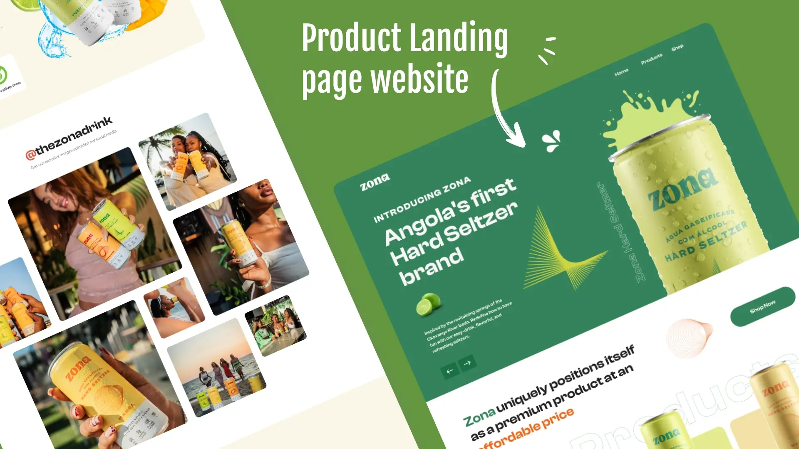

# $\color{green}\textbf{ZONA}$

$\color{limegreen}\text{Тренировочная работа}$

## $\color{mediumblue}\text{Описание работы }$:

Внешняя часть одностраничного интернет магазина по продаже напитков.

За основу взят произвольный макет из сети.

**Цели и задачи работы :**

❗Вёрстка страниц.

❗Интеграция вёрстки в CMS WordPress

❗Работа с хостингом

❗Настройка WordPress админ панели

🎯 $\color{mediumblue}\textsf{Основная задача }$ - "Натяжка" вёрстки на WordPress и создание сайта.

---

Макет -> [**Figma**](https://www.figma.com/design/yGjT5dcoXs3zhJxxJHjt3q/zona-readme-version-?node-id=0-1&p=f&t=1ovNWSZqTucOElKA-0)

Вёрстка -> [**Git pages**](https://artiom-work.github.io/zona/)

Сайт -> [**zona**](https://zona.artiom-mezheynikov.ru)

---

## $\color{mediumblue}\text{Технологии, инструменты и способы вёрстки }$:

✅ Sass
✅ БЭМ
✅ Flex
✅ Grid
✅ Адаптивная вёрстка
✅ Кроссбарузерная вёрстка
✅ Валидная вёрстка
✅ Семантическая вёрстка
✅ Мобильное меню (CSS + JS)
✅ Корзина товаров (CSS + JS + jQuery)
✅ Формы и валидация (HTML + JS)
✅ Git
✅ Figma
✅ SVG-спрайты
✅ Retina
✅ Hover/active эффекты
✅ WordPress
✅ ACF

---

## $\color{mediumblue}\textsf{Что сделано, итоги и выводы:}$
