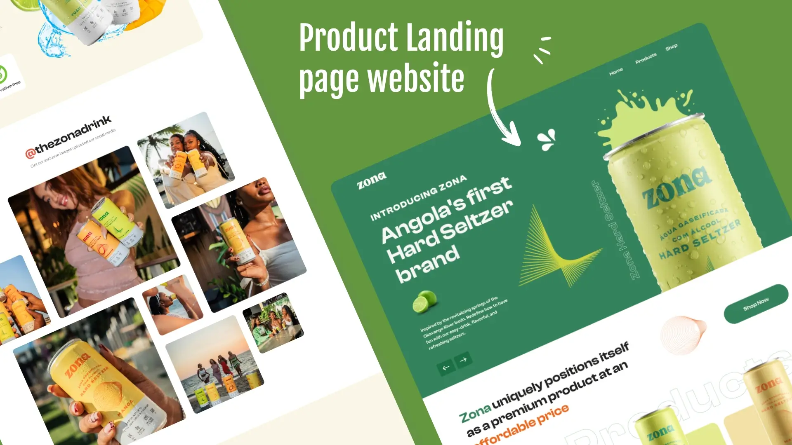

# $\color{green}\textbf{ZONA}$

$\color{limegreen}\text{Тренировочная работа}$

## $\color{mediumblue}\text{Описание работы }$:

Внешняя часть одностраничного интернет магазина по продаже напитков.

За основу взят произвольный макет из сети.

**Цели и задачи работы :**

❗Вёрстка страниц.

❗Интеграция вёрстки в CMS WordPress

❗Работа с хостингом

❗Настройка WordPress админ панели

❗Работа с WordPress плагинами

🎯 $\color{mediumblue}\textsf{Основная задача }$ - "Натяжка" вёрстки на WordPress и создание сайта.

---

Макет -> [**Figma**](https://www.figma.com/design/yGjT5dcoXs3zhJxxJHjt3q/zona-readme-version-?node-id=0-1&p=f&t=1ovNWSZqTucOElKA-0)

Вёрстка -> [**Git pages**](https://artiom-work.github.io/zona/)

Сайт -> [**zona**](https://zona.artiom-mezheynikov.ru)

---

## $\color{mediumblue}\text{Технологии, инструменты и способы вёрстки }$:

✅ WordPress
✅ phpMyAdmin
✅ FileZilla
✅ Git
✅ VS Code
✅ Figma
✅ PHP
✅ MySQL
✅ JS
✅ CSS3
✅ HTML5
✅ Sass
✅ БЭМ
✅ Flexbox
✅ CSS Grid
✅ CSS-функции
✅ Адаптивная вёрстка
✅ SVG-спрайты
✅ Мобильное меню (CSS)
✅ "Липкая шапка"
✅ Слайдеры (swiperJs)
✅ Кроссбарузерная вёрстка
✅ Hover/active эффекты
✅ Семантическая вёрстка
✅ Валидная вёрстка
✅ ACF
✅ Pods

<!-- ✅ WooCommerce товары, категорий, цены
✅ WooCommerce-блоки: «Коллекция товаров», «Фильтр товаров», «Рекомендуемый товар», «Выбор товара вручную»
✅ WooCommerce корзина
✅ WooCommerce (запуск магазина)
✅ WayForPay -->

---

## $\color{mediumblue}\textsf{Краткий список работ:}$

$\color{orange}\text{➡}$ Вёрстка главной страницы по макету figma ( близко к pixel perfect).

$\color{orange}\text{➡}$ Создание дополнительной карусели со сменой цвета фона в блоке promo.

$\color{orange}\text{➡}$ Правки и наполнение контентом: изображения и текст.

$\color{orange}\text{➡}$ Поблочный перенос вёрстки на хостинг с интеграцией CMS WordPress и настройка ACF полей (страница настроек сайта в wp админке) и пользовательских записей ( плагин Pods ) для вывода их циклом на страницу.

$\color{orange}\text{➡}$ Вёрстка и интеграция на сайт страницы политики конфеденциальности

$\color{orange}\text{➡}$ Вёрстка и интеграция на сайт страницы 404

$\color{orange}\text{➡}$

$\color{orange}\text{➡}$

$\color{orange}\text{➡}$

$\color{orange}\text{➡}$
